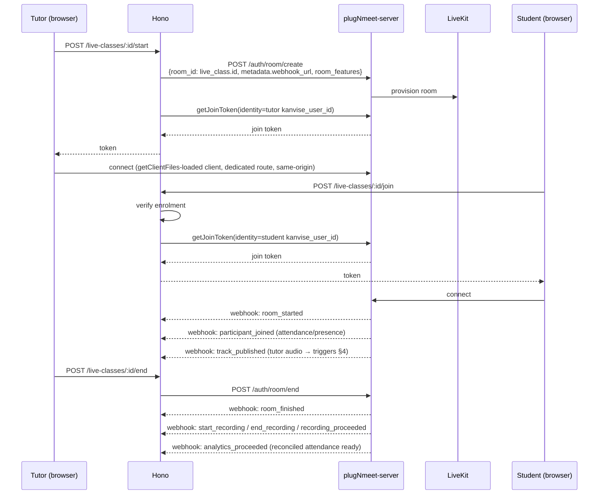
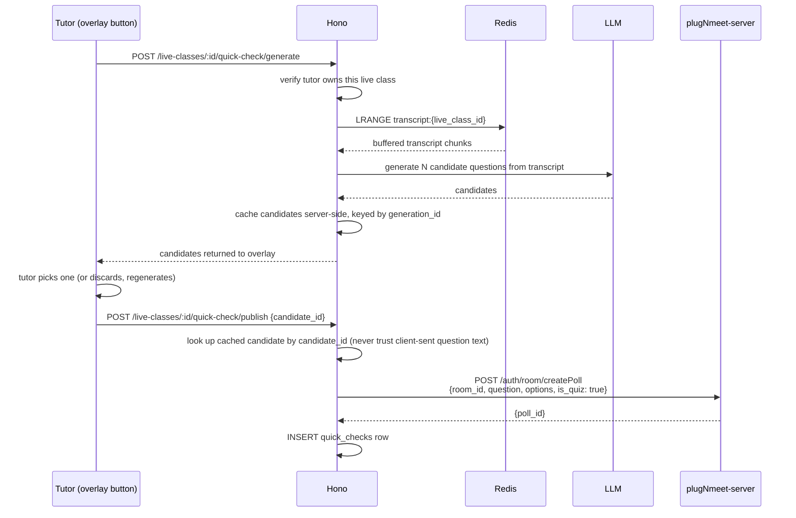

# Kanvise Live Class Architecture v3 — plugNmeet Integration

> **Current implementation scope (2026-09-21):** enrolled-room access, native
> tutor-created/AI-generated polls, attendance webhooks, on-demand recording
> lifecycle, private R2 playback, Deepgram post-recording transcription, and a
> Gemini class-summary draft that the tutor can edit and publish. Students see
> a published summary and recording only after enrolment access is verified.
> The live egress/streaming transcription and Kanvise-owned Quick Check design
> below are research only; the current product uses PlugNmeet's native AI poll
> composer.

**Status:** Supersedes v2. Read alongside
`plugnmeet-integration-reference.md` (the source-of-truth API reference) and
`plugnmeet-phase-0-validation-plan.md` (the mandatory evidence gate before
implementation planning). This document is the narrative design; where it and
the API reference disagree, the reference wins.

## 0. What changed since v2

- Webhook architecture **simplified**: plugNmeet re-emits `participant_joined`, `participant_left`, and `track_published` itself — confirmed from their own docs. The separate direct-to-LiveKit webhook subscription described in v2 is dropped. One `webhook_url`, set at room creation, covers presence, the egress trigger, and recording/analytics lifecycle.
- Attendance reconciliation confirmed: `analytics_proceeded` webhook fires when a post-session report is ready; the report itself is fetched via the **Artifact API** (the old dedicated Analytics API is deprecated). Per-user `duration`, `joined`, `left` fields come pre-computed — no manual summing of raw join/leave pairs.
- Quick Check now uses `createPoll` with `is_quiz: true` — correct-answer hide/reveal is handled by plugNmeet natively, not something Kanvise needs to track itself.
- Branding: confirmed official mechanism — `window.plugNmeetConfig.designCustomization` for colors/logo, `copyright_conf.display: false` to remove "Powered by plugNmeet" entirely. Not a CSS hack.
- Screen share defaulted OFF — whiteboard's native PDF/office upload already covers materials-sharing.
- The full `room_features` schema is now exact, sourced from their API docs — see the reference doc for the complete JSON.
- Recording processing is deliberately post-class: PlugNmeet produces the MP4,
  the API streams it to private R2, then sends the same stream to Deepgram and
  Gemini. The separate live egress bridge described in older sections is not
  enabled in this pilot.
- **Note on SDKs:** the published `plugnmeet-sdk-js` package (GitHub) appears to lag the current live API — it still lists deprecated analytics methods and is missing `createPoll` and the artifact endpoints entirely. Build against the documented REST API directly (HMAC-signed JSON POSTs) rather than assuming the SDK is complete; verify each method exists in the installed SDK version before relying on it.

## 1. Component Topology (Azure + AWS)

| VM | Runs |
|---|---|
| **App VM** | Hono API (PM2), scheduler/job worker, durable Kanvise database/R2 access |
| **Live Class VM (Azure)** | repurposed `kanvise-livekit` VM: plugNmeet-server, bundled LiveKit/NATS/Redis/MariaDB, and TURN |
| **Recorder VM (AWS EC2)** | on-demand `plugNmeet-recorder`; not provisioned yet, isolated from the classroom workload |

The Recorder VM is intentionally hosted separately on AWS so recording CPU and
memory spikes cannot degrade a live class. It must reach the Live Class VM's
media services over an authenticated private tunnel or tightly scoped firewall
rules. The recorder uploads the final MP4 directly to R2 from its
`post_transcoding` hook and calls Kanvise with an HMAC-authenticated delivery
notice; Kanvise never buffers or downloads the video through PlugNmeet. AWS
provisioning is blocked until provider credentials, region, and budget approval.

The two Redis responsibilities must not be conflated. The Redis colocated with
plugNmeet supports its realtime stack and may disappear when the Live Class VM
is deallocated. Kanvise transcript buffers, idempotency locks, candidate caches,
and post-class jobs live with the App tier or in managed Redis so VM shutdown
cannot destroy their only copy.

## 2. Feature Ownership — unchanged from v2

Whiteboard/PDF: 100% plugNmeet. Recording: `plugNmeet-recorder` MP4s uploaded
directly to R2 after transcoding. Polls/Quick Check delivery: PlugNmeet native
Polls and Generate with AI. STT and summaries: API-owned Deepgram + Gemini job
after verified R2 delivery. Guest classes use the same PlugNmeet server with a
restricted room profile.

## 3. Room Lifecycle (revised)



Single webhook source now (plugNmeet's), room_id = live_class.id, identity = kanvise_user_id throughout — all unchanged decisions, just drawn against the confirmed single-webhook model.

### 3.1 Two classroom profiles

Kanvise has two intentionally different room profiles:

1. **Enrolled class** — requires a programme/course enrolment and enables the
   Kanvise learning layer: reconciled attendance, transcription, Quick Check,
   recording, and post-class recap.
2. **Guest demo class** (`access_mode = anyone_with_link`) — uses the standalone
   plugNmeet client so a tutor can share a low-friction class without first
   creating a programme. Kanvise still creates the temporary room and issues a
   short-lived guest join token; the browser never receives the plugNmeet API
   secret. This profile does **not** run transcription, Quick Check, recording,
   reconciled student attendance, recap generation, or recap notifications.

The guest path still keeps the Kanvise `live_classes` row, hashed share token,
expiry/revocation controls, and tutor ownership. "Standalone" describes the
classroom experience, not an unauthenticated plugNmeet deployment.

### 3.2 Student bandwidth policy

Both classroom profiles use the audio-first client defaults defined in the
integration reference. Adaptive Stream, Dynacast, and Simulcast remain enabled;
webcam capture defaults to 360p; camera is off on entry; students enter muted;
and only a small, device-specific number of webcams may be visible at once.
Screen share remains disabled in favour of the whiteboard/PDF path.

The UI should communicate degraded states plainly: when bandwidth is poor,
preserve tutor audio, lower or pause video automatically, keep the whiteboard
usable, and show a small "Saving data"/connection-quality indicator rather than
treating lower video resolution as an error. Reconnecting must reuse cached
client assets and must not silently enable camera or microphone.

Phase 0 owns the final numbers. The initial student budgets are 50 MB/hour for
audio-only and 300 MB/hour for one 360p tutor webcam plus audio, excluding the
first application load and intentional document downloads.

## 4. Legacy live-transcription design (not enabled in this pilot)

The following egress/Bridge design is retained as future research only. The
current implementation does not start a LiveKit egress or expose a transcript
stream during class. It waits for the recorder's verified R2 delivery, then
sends that MP4 to Deepgram after class.

### 4.1 Trigger

On the `track_published` webhook from plugNmeet, Hono first checks that this is
an **enrolled class**, then checks whether it is the assigned tutor's audio
track (not video, not a student's). If yes, proceed. Guest demo classes stop at
the first check. This is deliberately not triggered on `room_started` — the
tutor may not have unmuted/negotiated their track yet at that instant, and
firing egress against a track that doesn't exist yet fails.

### 4.2 Starting egress

Hono calls LiveKit's Egress API directly (not through plugNmeet):

```ts
const info = await egressClient.startEgress({
  roomName,
  media: { audioTrackId: trackID },
  outputs: [{
    stream: {
      protocol: "WEBSOCKET",
      urls: [signedBridgeUrl],
    },
  }],
});
```

Use LiveKit's current `StartEgress` API with a `MediaSource` selecting the tutor
audio track and a WebSocket `StreamOutput`. The older `startTrackEgress` API is
deprecated. WebSocket output is audio-only but is transcoded, so capacity tests
must include the egress CPU cost rather than assuming a zero-transcode path.

Kanvise constructs the destination WebSocket URL itself, embedding
`live_class_id`, `track_id`, expiry, nonce, and a server-generated signature.
The Bridge rejects expired, replayed, or invalid signatures. This lets the
single Bridge process resolve the session immediately without exposing an
unauthenticated audio-ingest endpoint.

### 4.3 What arrives at the Bridge worker

LiveKit opens a WebSocket connection to the URL Kanvise gave it and sends:

- **Binary frames**: raw audio, format `pcm_s16le` (16-bit signed little-endian PCM), sample rate matching whatever the tutor's client actually negotiated — typically 48kHz, but not guaranteed, so the Bridge should read the actual rate rather than hardcode it if LiveKit's egress info response exposes it, or explicitly pin 48kHz on the room's audio codec config to be sure.
- **Text frames**: JSON events on the track itself — `{"muted": true}` / `{"muted": false}` when the tutor mutes/unmutes. The Bridge should pause forwarding audio to Deepgram (or just let silence through — Deepgram handles silence fine, simpler to just keep streaming) but at minimum shouldn't treat a mute event as an error.
- The connection **closes automatically** when the track is unpublished or the tutor leaves — this is the natural signal to close out the Deepgram connection and stop writing to the transcript buffer for that class. No explicit "stop" call needed on the Kanvise side for the common case (tutor ends class normally).

### 4.4 Bridge worker → Deepgram

The Bridge opens its own WebSocket to Deepgram per incoming egress connection (one Deepgram session per live class, not shared):

```
wss://api.deepgram.com/v1/listen?encoding=linear16&sample_rate=<matching-rate>&punctuate=true&smart_format=true
```

Headers: `Authorization: Token <DEEPGRAM_API_KEY>`.

Critical detail: `encoding=linear16` is Deepgram's name for exactly the same format LiveKit calls `pcm_s16le` — same bytes, different vendor naming, no conversion needed. `sample_rate` **must match** what's actually arriving from LiveKit exactly, or Deepgram will decode garbage silently rather than erroring — this is the "silent failure spot" to test explicitly with a real session before trusting it in production, not something that fails loudly if wrong.

Binary frames received from LiveKit are forwarded to Deepgram as binary frames, essentially a direct passthrough — the Bridge's real job is session bookkeeping (§4.5), not audio processing.

### 4.5 Session-scoping and the transcript buffer

The Bridge is a single long-running process, not one process per class. An
incoming egress WebSocket is keyed by its persisted `egress_id`/`track_id`, with
a separate one-active-transcription lock for the `live_class_id`. This avoids a
tutor reconnect or a retried webhook overwriting an existing connection:

```
Map<egress_id, {
  liveClassId: string,
  trackId: string,
  deepgramSocket: WebSocket,
  lastActivity: timestamp
}>
```

As Deepgram returns transcript JSON (interim and final results), the Bridge appends the finalized text to Redis:

```
RPUSH transcript:{live_class_id} "<finalized text chunk>"
EXPIRE transcript:{live_class_id} <class_duration_estimate + buffer>
```

A list, not a single string, so Quick Check can pull accumulated finalized
chunks. Each entry stores text, start/end timestamps, and the provider result
ID so retries can be deduplicated. Final chunks are also persisted
incrementally to durable storage; Redis is a working buffer, not the only copy.

On the WebSocket closing (track unpublished / tutor left), the Bridge closes its Deepgram connection and lets the Redis key expire naturally rather than deleting it immediately — gives a short grace window in case Quick Check was mid-generation when class ended.

## 5. Quick Check — future Kanvise-owned extension

This section is shelved for the pilot. Tutors currently use PlugNmeet's native
**Generate with AI** poll composer inside the classroom: they type a prompt,
edit the generated native poll, and publish it with PlugNmeet controls. No
custom overlay, transcript context, or fork is required. The design below is
kept only for a later product decision.



### 5.1 Generate

`POST /live-classes/:id/quick-check/generate` — tutor-auth,
ownership-checked, and restricted to enrolled classes. Reads a bounded recent
window from the transcript, sends it to the LLM with a prompt asking for a
handful of candidate MCQ questions with one correct answer each, then validates
the structured result. Candidates are cached in shared Redis, bound to the
class, tutor, and generation, and expire after a few minutes. Do not use an
in-memory fallback under PM2. Nothing is written to Postgres yet.

### 5.2 Overlay

The tutor's browser renders the candidates in the Kanvise-owned DOM overlay sitting above the `getClientFiles`-embedded plugNmeet client (same page, higher z-index — not part of plugNmeet's component tree at all). Tutor picks one or discards and re-generates.

### 5.3 Publish

`POST /live-classes/:id/quick-check/publish { candidate_id }` — Hono looks the chosen candidate up from its own server-side cache by id. **The client never sends question text back** — only the id of something Hono already generated and holds — so a tampered request can't inject arbitrary content into a poll pushed to an entire class of students. Same trust boundary as everywhere else in the system: content that gets persisted or broadcast is never taken verbatim from the client.

Hono then calls:

```json
POST /auth/room/createPoll
{
  "room_id": "<live_class_id>",
  "question": "<candidate question text>",
  "options": [
    { "id": 1, "text": "...", "is_correct": true },
    { "id": 2, "text": "..." },
    { "id": 3, "text": "..." }
  ],
  "is_quiz": true,
  "is_anonymous": false
}
```

`is_anonymous: false` is required here — `true` would mean plugNmeet never stores which student picked which option at all, which would foreclose the per-student tracking that's still a parked "nice if we get it" item. `is_quiz: true` gets the correct-answer hide-while-running/reveal-on-close behavior for free — plugNmeet's own state machine handles it, not Kanvise's.

The response's `poll_id` is stored on a new `quick_checks` row (unchanged schema from v2 — `school_id`, `live_class_id`, `course_id`, `tutor_id`, `question_text`, `options` jsonb, `plugnmeet_poll_id`, `created_at`).

### 5.4 Results (still genuinely open)

Per your own call, not building this yet. What's now known, for whenever it's picked back up: the analytics report generated after the session ends includes a per-user `voted_poll` field. Whether that field records *which* option each student picked, or just *whether* they voted at all, hasn't been confirmed — that's the specific thing to check against a real generated report before assuming `quick_check_responses` can be populated from it. If it turns out to be too coarse, the fallback is whatever `createPoll`'s sibling result-fetching mechanism turns out to be — not yet looked into, since this whole area is parked.

## 6. Post-Class Recap (Catch-Up Notes)

Uniform, not personalized — deliberately simplified after weighing it. Recaps
exist only for **enrolled classes**. No-shows need the full summary same as
anyone else; full attendees still get value from it as revision material, not
just a gap-filler for what they missed. One canonical summary per class,
identical content to every student enrolled in that course. Guest demo classes
never create a recap. No attendance-diffing, no per-student LLM calls.

**Flow:**

1. On `recording_proceeded`, Hono records an idempotent recording-processing job
   and acknowledges the webhook quickly. The worker obtains a one-time
   PlugNmeet download token and streams the MP4 to private R2 while teeing the
   bytes to Deepgram.
2. The worker stores a private transcript JSON object, asks Gemini for one
   canonical summary, and writes `live_class_recaps.status = 'draft'`. Failures
   retry up to three times and remain visible in the job/recording status.
3. The assigned tutor opens the completed class in Schedule, edits the draft,
   and clicks **Approve and publish**. The API rechecks tutor ownership and
   stores the published body.
4. Publishing creates one in-app `class_recap_ready` notification per student
   enrolled in the course. The student can then open My Classes, obtain a
   short-lived recording URL, and read the published summary. No per-student
   LLM content is generated.

**Schema:**

```sql
CREATE TABLE live_class_recaps (
  id UUID PRIMARY KEY DEFAULT gen_random_uuid(),
  school_id UUID NOT NULL REFERENCES schools(id),
  live_class_id UUID NOT NULL REFERENCES live_classes(id),
  course_id UUID NOT NULL REFERENCES courses(id),
  tutor_id UUID NOT NULL REFERENCES user_profiles(id),
  raw_transcript_key TEXT,
  draft_body TEXT,
  published_body TEXT,
  status TEXT NOT NULL DEFAULT 'pending' CHECK (status IN ('pending', 'generating', 'draft', 'published', 'failed')),
  approved_by UUID REFERENCES user_profiles(id),
  failure_reason TEXT,
  model_metadata JSONB,
  created_at TIMESTAMPTZ NOT NULL DEFAULT now(),
  updated_at TIMESTAMPTZ NOT NULL DEFAULT now(),
  published_at TIMESTAMPTZ
);

CREATE UNIQUE INDEX class_recaps_one_per_class ON class_recaps(live_class_id);
```

**Implemented migration note:** the current
`notifications_type_check` constraint already includes
`live_class_reminder`, `assignment_deadline`, `mock_published`,
`payment_confirmed`, `enrolment_confirmed`, `submission_graded`,
`mock_fully_graded`, and `class_cancelled`. Delivering the recap as an in-app
notification requires a migration that recreates the constraint with
`class_recap_ready` added; it is not a free insert. RLS is enabled on recording
and recap tables with server-side service-role access only; API routes enforce
student enrolment and tutor ownership before returning anything.

## 7. Recording Storage — current implementation

Recording is enabled only for enrolled classes. The AWS Recorder VM is the
planned on-demand capture host but is not deployed yet. Once available,
`recording_proceeded` starts a background job that obtains a one-time token from
`/recording/getDownloadToken` and streams the file into private R2 under
`schools/{school_id}/private/live_class_recording/...`; Hono never buffers the
complete MP4. The job records size and SHA-256, is idempotent by provider
recording ID, and exposes only short-lived signed playback URLs to authorized
students/tutors. PlugNmeet source deletion is intentionally deferred until a
validated retention policy and end-to-end R2 verification are in place.

## 8. Open Items

Carried forward, still genuinely unresolved:

- **`voted_poll` field granularity** — blocks `quick_check_responses` (§5.4).
- **Azure credit type/duration** — unresolved, affects whether this is a disposable pilot deployment.
- **VM sizing under real concurrent load** — untested assumption, watch CPU on the Live Class VM once multiple simultaneous classes are running for real.
- **AWS recorder provisioning** — credentials, region, budget approval, private
  networking, and the recorder's PlugNmeet configuration are still required.
- **Deepgram provider configuration** — add a staging API key/model and validate
  the MP4 container contract with a real recording before enabling the worker.
- **Cross-cloud recorder networking/storage** — validate the AWS Recorder VM's
  secure media connectivity and R2 transfer mechanism before production.

## 9. Summary of what's shelved

Unchanged from v2: custom Excalidraw whiteboard + PDF-splitting pipeline, BBB-style event-stream recording, raw Hono-issued LiveKit tokens (now issued via plugNmeet). Added this pass: the separate direct-to-LiveKit webhook subscription (plugNmeet's own relay covers it).
